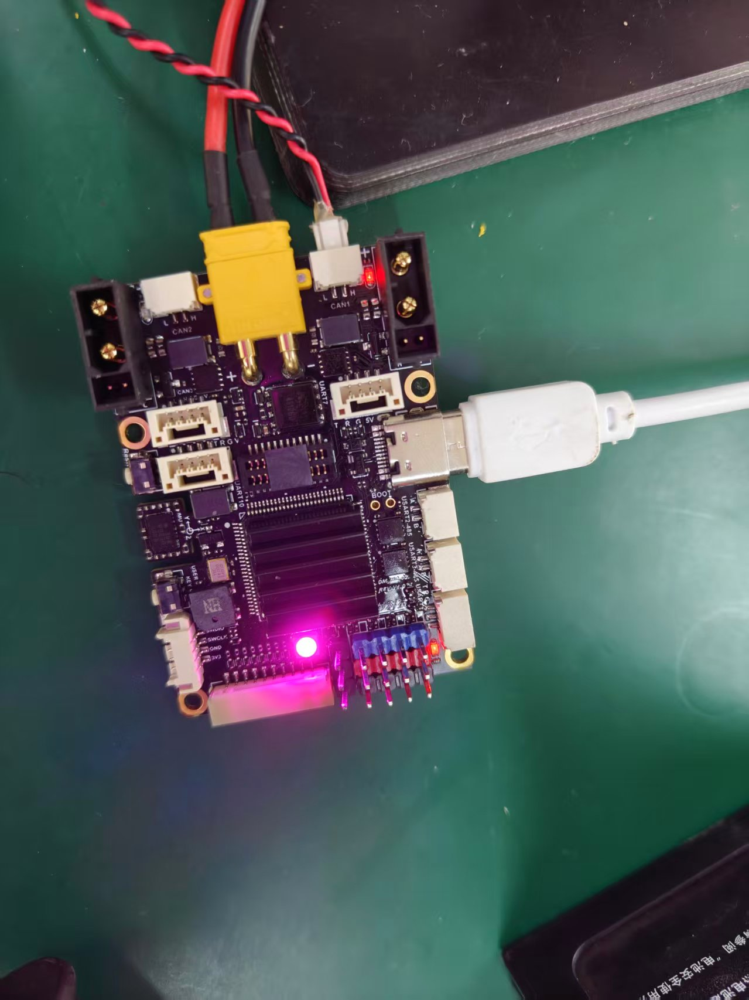

## 实机操作流程

如图，你需要为达妙开发板接入24V电源以正常使能CAN收发器。同时，你需要将CAN1连接到机械臂上。你也可以使用XT30 2+2接口进行串联。

接下来，确认机械臂各个关节之间的XT30 2+2 线连接正常，可以在通电之后观察每个关节的红灯是否亮起来确认。

最后，将达妙开发板的USB连接到Linux PC上，即可通过SDK对机械臂进行控制

## 上电流程

- 若达妙开发板和机械臂的电源为串联，则只需正常通电即可

- 若达妙开发板和机械臂未接在同一电源上，则需要先启动机械臂电源，再启动达妙开发板

注意，无论如何，一定要先启动24V电源，再连接USB设备，否则PC可能无法正常与机械臂通信
